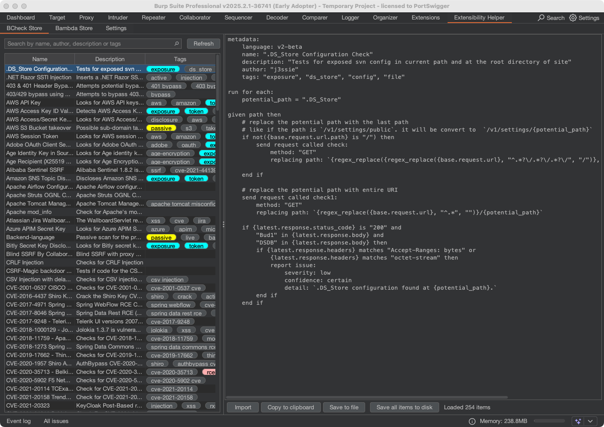
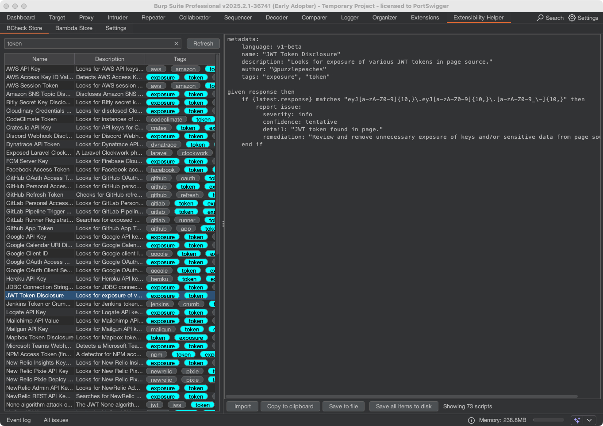
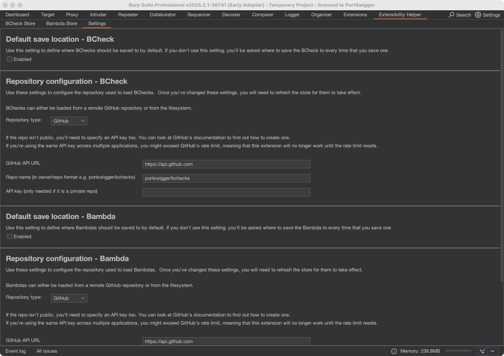

# Extensibility Helper
*Extensibility Helper* makes finding and importing BChecks scripts and Bambda snippets into Burp easier by loading them from either a remote GitHub or local Git repository.

Relevant BChecks or Bambdas can be found by searching for keywords or tags within the scripts.
These can then be exported to the filesystem or copied to the clipboard to facilitate their import and subsequent
use within Burp.

Once loaded, *Extensibility Helper* will add a tab titled 'Extensibility Helper', which contains three sub-tabs:

* BCheck Store - this shows all BChecks that have been retrieved from the repository
* Bambda Store - this shows all Bambdas that have been retrieved from the repository
* Settings - this allows configuration of the BApp

## Loading Extensibility Helper
The easiest way of obtaining *Extensibility Helper* is via Burp's [BApp Store](https://portswigger.net/bappstore/41274be469184a56b06d6a791ce8a9ce).
See Burp's [documentation](https://portswigger.net/burp/documentation/desktop/extensions/installing-extensions) for additional details.

## Building Extensibility Helper
Alternatively, *Extensibility Helper* can be built from source.

* Ensure that Java JDK 21 or newer is installed
* From the root of the project, run the command `./gradlew jar`
* This should place the JAR file `extensibility-helper-3.0.0.jar` within the `build/libs` directory
* This can be loaded into Burp by navigating to the 'Extensions' tab, 'Installed' sub-tab, clicking the 'Add' button and loading the JAR file

## Requirements
*Extensibility Helper* currently requires Burp Suite v2023.12 or newer. As BChecks are used by Burp's Scanner, *Extensibility Helper*
is only available for Burp Suite Professional edition.

## Finding BChecks and Bambdas
When the extension loads, all BChecks and Bambdas are retrieved from the repository and rendered in the table within
the appropriate *Store* tab. For each item, the table shows:

* Name
* Description
* Tags

The table can be quickly filtered using the search bar to find the most relevant items.

The filter performs a case-insensitive match on items containing the search term within any of the following fields:

* Name
* Author
* Description
* Tags

## Importing Items
### BChecks
#### Importing a single BCheck directly (Burp 2023.12 onwards)
1. Select the relevant BCheck within the table
2. Click the 'Import' button

The BCheck should now be listed and enabled within Burp's BCheck table and ready for use by the Scanner.

#### Importing a single BCheck using the clipboard
1. Select the relevant BCheck within the table
2. Click the 'Copy to Clipboard' button
3. Navigate to the 'Extensions' tab
4. Select the 'BChecks' sub-tab
5. Click the 'New' button and then the 'Blank' options from the popup menu
6. Paste the copied BCheck into the 'BChecks editor'
7. Click 'Save'

The BCheck should now be listed and enabled within Burp's BCheck table and ready for use by the Scanner.

#### Importing a single BCheck using the filesystem
1. Select the relevant BCheck within the table
2. Click the 'Save to file' button
3. Unless you have configured a default save location, you will be presented with a file dialog and asked to choose a directory to save the script in.
4. After clicking 'OK', the BCheck will be saved to the specified directory, and the path will be shown within the status bar adjacent to the buttons.
5. Navigate to the 'Extensions' tab
6. Select the 'BChecks' sub-tab
7. Click the 'Import' button
8. Navigate to and select the exported BCheck
9. Click 'Open'

The BCheck should now be listed within Burp's BCheck table. Note that unlike using the import mechanism via the clipboard,
the script will need to be enabled before it can be used by the Scanner.

#### Importing multiple BChecks
Burp does not currently recurse directory structures whilst importing BCheck scripts, so *BCheck Helper*  will save all
scripts into a single directory to facilitate bulk importing of BCheck scripts.

1. Optionally apply any filter to the table
2. Click the 'Save all items to disk' button
3. Unless you have configured a default save location, you will be presented with a file dialog and asked to choose a directory to save the scripts in.
4. After clicking 'OK', the BChecks will be saved to the specified directory whose path will be shown within the status bar adjacent to the buttons.
5. Navigate to the 'Extensions' tab
6. Select the 'BChecks' sub-tab
7. Navigate to and select the directory used for the export
8. Click 'Open'

The BChecks should now be listed within Burp's BCheck table. Note that unlike using the import mechanism via the
clipboard, the scripts will need to be enabled before they can be used by the Scanner.

#### Using BChecks within the Scanner
See the relevant section of Burp's [documentation](https://portswigger.net/burp/documentation/desktop/automated-scanning/bchecks).

### Bambdas
#### Importing a single Bambda directly
*This action is not currently supported.*
This functionality should be available in Burp Suite **v2025.4 onwards**.
Please add your support for this functionality on the following GitHub issue: [Montoya API function for importing to Bambda library](https://github.com/PortSwigger/burp-extensions-montoya-api/issues/112)

#### Importing a single Bambda using the clipboard
1. Select the relevant Bambda within the table
2. Click the 'Copy to Clipboard' button
3. Navigate to the 'Extensions' tab
4. Select the 'Bambda library' sub-tab
5. Click the 'New' button and then the 'Blank' options from the popup menu
6. Paste the copied Bambda into the 'Bambda editor'
7. Click 'Save'

#### Importing a single Bambda using the filesystem
1. Select the relevant Bambda within the table
2. Click the 'Save to file' button
3. Unless you have configured a default save location, you will be presented with a file dialog and asked to choose a directory to save the script in.
4. After clicking 'OK', the Bambda will be saved to the specified directory, and the path will be shown within the status bar adjacent to the buttons.
5. Navigate to the 'Extensions' tab
6. Select the 'Bambda library' sub-tab
7. Click the 'Import' button
8. Navigate to and select the exported Bambda
9. Click 'Open'

#### Importing multiple Bambdas
1. Optionally apply any filter to the table
2. Click the 'Save all items to disk' button
3. Unless you have configured a default save location, you will be presented with a file dialog and asked to choose a directory to save the scripts in.
4. After clicking 'OK', the Bambdas will be saved to the specified directory whose path will be shown within the status bar adjacent to the buttons.
5. Navigate to the 'Extensions' tab
6. Select the 'Bambda library' sub-tab
7. Navigate to and select the directory used for the export
8. Click 'Open'

#### Use Bambdas in the Bambda library
Find out more about the Bambda library in [PortSwigger's documentation](https://portswigger.net/burp/documentation/desktop/extend-burp/bambdas).

## Configuration
The *Settings* sub-tab can be used to configure *Extensibility Helper*.

These settings are persistent between Burp sessions.

### Configuring a default export location
By default, you are prompted for a location when saving items. Alternatively, a default location can be set by
enabling the checkbox within the 'Default save location - BCheck' or 'Default save location - Bambda' panel and clicking the 'Choose directory' button.

### Configuring the repository
By default, BChecks will be loaded from 
PortSwigger's [curated BCheck GitHub repository](https://github.com/portswigger/bchecks) and Bambdas will be loaded from PortSwigger's [curated Bambda GitHub repository](https://github.com/portswigger/bambdas) where Burp users can share their
scripts. 

In general, items can either be loaded from either a GitHub server or a local Git repository. 
You can choose between these options by toggling the 'Repository type' option between 'GitHub' and 'Filesystem' under the
'Repository configuration - BCheck/Bambda' section of the settings tab, and then change the respective settings that appear. 

#### Configuring a different GitHub repository
Change the 'Repository type' option to 'GitHub'.

The 'Repo name' setting within the 'GitHub configuration' panel can be used to point to a different repository.
By default, this should be hosted on [GitHub](https://github.com/), but the 'Repo URL' setting can be used to fetch BChecks from
alternative GitHub servers.

If the repository is private, then you will need to provide an API key within the 'API key' field.

Once the repository name has been changed, clicking the 'Refresh' button on the appropriate table panel will update the items using the new configuration.

#### Configuring a local repository
Change the 'Repository type' option to 'Filesystem', and then set the 'Repository root directory' setting to the location
of your local Git repository.

### Logging
Enable the checkbox within the 'Logging' panel to obtain additional logging. Mostly, this relates to the
downloading and unpacking of the scripts from GitHub.

## Issues / Enhancements
If you have found a bug or think that a particular feature is missing, please raise an issue on the [GitHub repository](https://github.com/josh-psw/bcheck-helper/issues).
Pull requests are also extremely welcome :).

