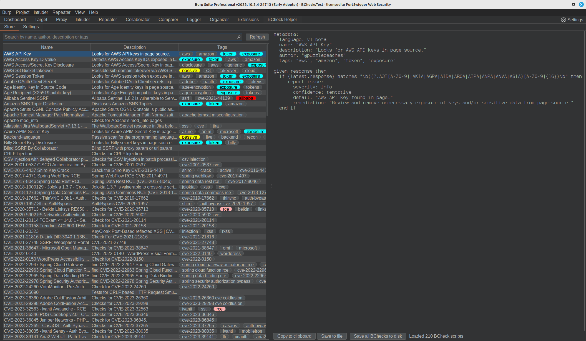
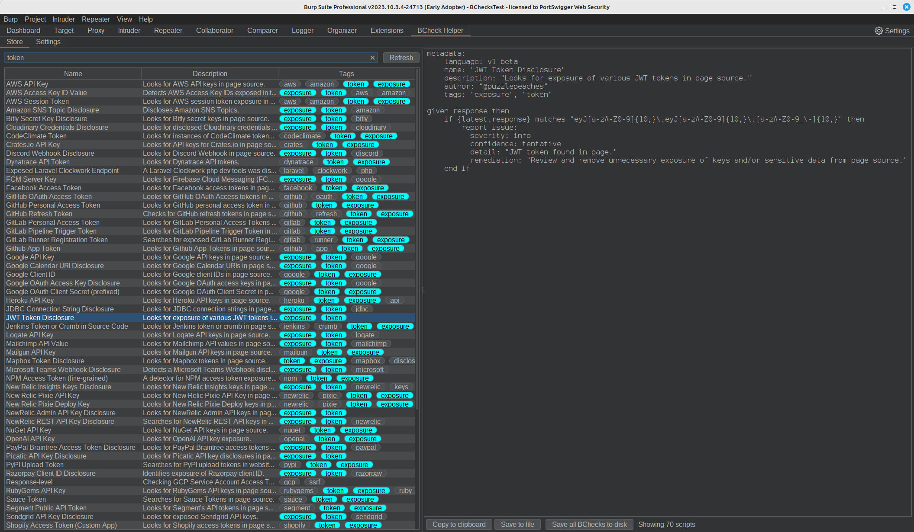
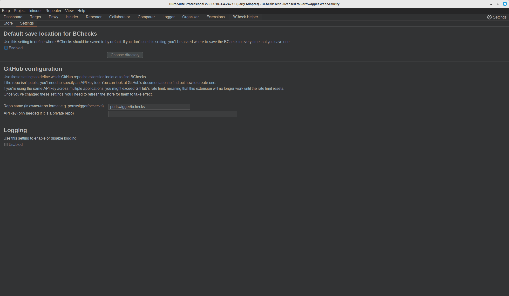

# BCheck Helper
*BCheck Helper* makes finding and importing BChecks scripts into Burp easier by loading them from a remote GitHub repository.

Relevant BChecks can be found by searching for keywords or tags within the scripts.
These can then be exported to the filesystem or copied to the clipboard to facilitate their import and subsequent
use within Burp.

Once loaded, *BCheck Helper* will add a tab titled 'BCheck Helper', which contains two sub-tabs:

* Store - this shows all BChecks that have been retrieved from the repository,
* Settings - this allows configuration of the BApp.

## Loading BCheck Helper
The easiest way of obtaining *BCheck Helper* is via Burp's [BAppStore](https://portswigger.net/bappstore/41274be469184a56b06d6a791ce8a9ce).
See Burp's [documentation](https://portswigger.net/burp/documentation/desktop/extensions/installing-extensions) for additional details.

## Building BCheck Helper
Alternatively, *BCheck Helper* can be built from source.

* Ensure that Java JDK 17 or newer is installed
* From the root of the project, run the command `./gradlew jar`
* This should place the JAR file `bcheck-helper.jar` within the `build/libs` directory
* This can be loaded into Burp by navigating to the 'Extensions' tab, 'Installed' sub-tab, clicking the 'Add' button and loading the JAR file

## Requirements
BCheck Helper currently requires Burp Suite v2023.10 or newer. As BChecks are used by Burp's Scanner, BCheck Helper
is only available for Burp Suite Professional edition.

## Finding BChecks
When the extension loads, all the BChecks are retrieved from the repository and rendered in the table within
the *Store* tab. For each BCheck, the table shows:

* Name
* Description
* Tags

The table can be quickly filtered using the search bar to find the most relevant BChecks.

The filter performs a case-insensitive match on BChecks containing the search term with any of the following fields:

* Name
* Author
* Description
* Tags

## Importing BChecks
### Importing a single BCheck using the clipboard
1. Select the relevant BCheck within the table
2. Click the 'Copy to Clipboard' button
3. Navigate to the 'Extensions' tab
4. Select the 'BChecks' sub-tab
5. Click the 'New' button and then the 'Blank' options from the popup menu
6. Paste the copied BCheck into the 'BChecks editor'
7. Click 'Save'

The BCheck should now be listed and enabled within Burp's BCheck table and ready for use by the Scanner.

### Importing a single BCheck using the filesystem
1. Select the relevant BCheck within the table
2. Click the 'Save to file' button
3. Unless you have configured a default save location, you will be presented with a file dialog and asked to choose a directory to save the script in.
4. After clicking 'OK', the BCheck will be saved to the specified directory, and the path will be shown within the status bar adjacent to the buttons.
5. Navigate to the 'Extensions' tab
6. Select the 'BChecks' sub-tab
7. Click the 'Import' button
8. Navigate to and select the exported BCheck
9. Click 'Open'

The BCheck should now be listed within Burp's BCheck table. Note that unlike using the import mechanism via the clipboard,
the script will need to be enabled before it can be used by the Scanner.

### Importing multiple BCheck
Burp does not currently recurse directory structures whilst importing BCheck scripts, so *BCheck Helper*  will save all
scripts into a single directory to facilitate bulk importing of BCheck scripts.

1. Optionally apply any filter to the table
2. Click the 'Save all BChecks to disk' button
3. Unless you have configured a default save location, you will be presented with a file dialog and asked to choose a directory to save the scripts in.
4. After clicking 'OK', the BChecks will be saved to the specified directory whose path will be shown within the status bar adjacent to the buttons.
5. Navigate to the 'Extensions' tab
6. Select the 'BChecks' sub-tab
7. Navigate to and select the directory used for the export
8. Click 'Open'

The BChecks should now be listed within Burp's BCheck table. Note that unlike using the import mechanism via the
clipboard, the scripts will need to be enabled before they can be used by the Scanner.

### Using BChecks within the Scanner
See the relevant section of Burp's [documentation](https://portswigger.net/burp/documentation/desktop/automated-scanning/bchecks).

## Configuration
The *Settings* sub-tab can be used to configure *BCheck Helper*.

These settings are persistent between Burp sessions.

### Configuring a default export location
By default, you are prompted for a location when saving BChecks. Alternatively, a default location can be set by
enabling the checkbox within the 'Default save location for BChecks' panel and clicking the 'Choose directory' button.

### Configuring a different GitHub repository
By default, *BCheck Helper* will retrieve BChecks from PortSwigger's [curated repository](https://github.com/portswigger/bchecks),
where Burp users can share their BChecks.
The 'Repo name' setting within the 'GitHub configuration' panel can be used to point to a different repository.
Note that this still has to be hosted on [GitHub](https://github.com/). If this restriction is too onerous,
please open an issue to make this configurable.

If the repository is private, then you will need to provide an API key within the 'API key' field.

Once the repository name has been changed, clicking the 'Refresh' button on the table panel will update the BChecks using the new configuration.

### Logging
Enable the checkbox within the 'Logging' panel to obtain additional logging. Mostly, this relates to the
downloading and unpacking of the BCheck scripts from GitHub.

## Issues / Enhancements
If you have found a bug or think that a particular feature is missing, please raise an issue on the [GitHub repository](https://github.com/josh-psw/bcheck-helper/issues).
Pull requests are also extremely welcome :).

